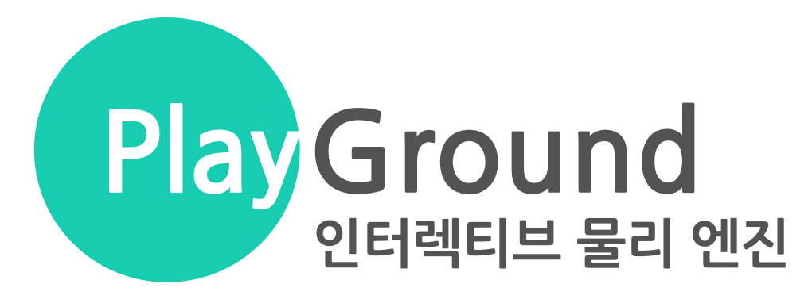
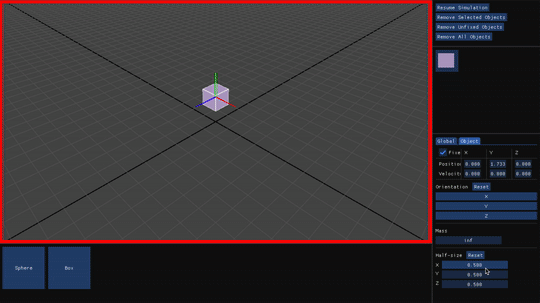
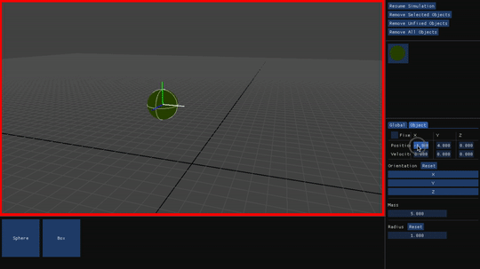
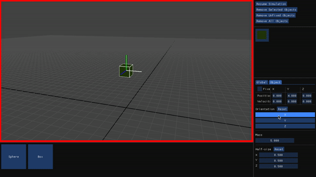
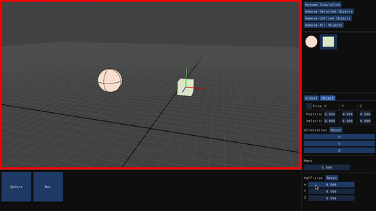
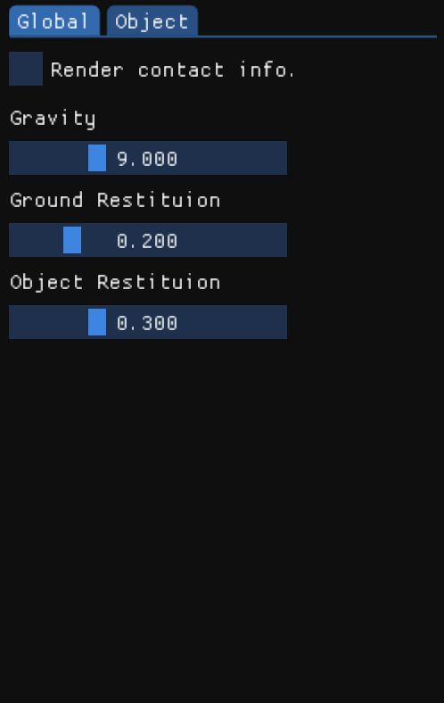

---
  



  
**Playground** 는 키보드와 마우스를 통해 조작 가능한 강체 물리 엔진입니다.  
아래와 같은 기능들을 지원합니다.  
- Semi-implicit Euler 적분
- 충돌 감지 (*Separating Axis Test*)
- 충격량 (*Impulse*) 기반 충돌 처리
- GUI 를 통한 시뮬레이션 조작  
  
## 의존성
- [GLFW](https://www.glfw.org) (3.3 버전에서 작동 확인)
- [Dear ImGui](https://github.com/ocornut/imgui) (1.79 버전에서 작동 확인)
  
## 빌드하기  
아래의 명령어를 터미널에 입력합니다.  
```shell
g++ -o playground src/main.cpp src/playground/* src/physics/* src/graphics/* src/gui/* -std=c++11 -framework OpenGL -lglfw -I include -DIMGUI_IMPL_OPENGL_LOADER_GLAD
```  
  
## 조작법  
  
- **카메라**   

    - **W, S, A, D** : 앞, 뒤, 왼쪽, 오른쪽으로 이동합니다.  
    - **마우스 왼쪽 드래그** : 드래그한 방향의 반대로 이동합니다.
    - **마우스 오른쪽 드래그** : 화면 중심을 축으로 회전합니다.  

- **오브젝트**  

    - **생성**  
    좌측 하단의 버튼을 눌러 원하는 도형의 오브젝트를 생성합니다.  
      
    - **위치(Position) & 속도(Velocity)**  
      
    X, Y, Z 축의 슬라이더 위에 커서를 위치하면 해당 축이 하얀색으로 강조됩니다.  
    이 슬라이더를 드래그하여 값을 변경합니다.  
    *속도 값은 시뮬레이션 중에 변경할 수 없습니다.*  
    *Fixed 를 체크하여 오브젝트의 위치를 고정합니다.*  
      
    - **방향(Orientation)**  
      
    X, Y, Z 축의 슬라이더 위에 커서를 위치하면 해당 축이 하얀색으로 강조됩니다.  
    이 슬라이더를 드래그하면 해당 축을 기준으로 오브젝트가 회전합니다.  
      
    - **도형 특성**  
      
    각 도형의 특성을 슬라이더를 드래그하여 변경합니다.  

- **시뮬레이션 설정**  

      
      
    - **Render contact info.**  
    충돌 정보(충돌점, 충돌 법선 벡터)의 출력 여부를 결정합니다.  
    - **중력(Gravity)**  
    모든 오브젝트에 적용되는 중력의 크기를 변경합니다.  
    - **오브젝트-지면 간 반발 계수(Ground Restitution)**  
    오브젝트와 지면 사이 충돌의 반발 계수를 변경합니다.  
    - **오브젝트 간 반발 계수(Object Restitution)**  
    오브젝트 간 충돌의 반발 계수를 변경합니다.  
