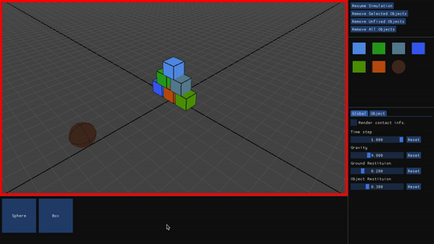
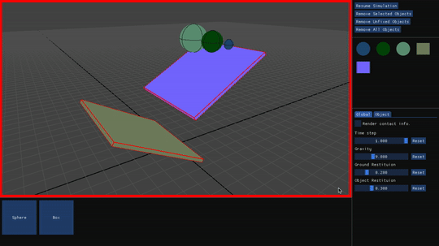

# Playground
Playground is a simple interactive physics engine which supports
- Rigid body simulation
- Real-time collision detection
- Sequential Impulse Solver based collision resolution




## Dependencies
- [GLAD](https://glad.dav1d.de) (Tested with version 0.1.33)
- [GLFW](https://www.glfw.org) (Tested with version 3.3)
- [Dear ImGui](https://github.com/ocornut/imgui) (Tested with version 1.79)
  
## How to build  
Enter the following command in your terminal.  
```shell
g++ -o playground src/main.cpp src/playground/* src/physics/* src/graphics/* src/gui/* -std=c++11 -framework OpenGL -lglfw -I include -DIMGUI_IMPL_OPENGL_LOADER_GLAD
```  